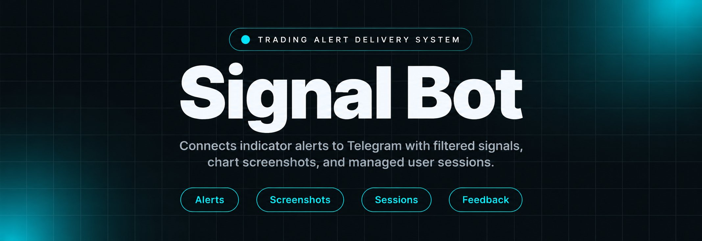
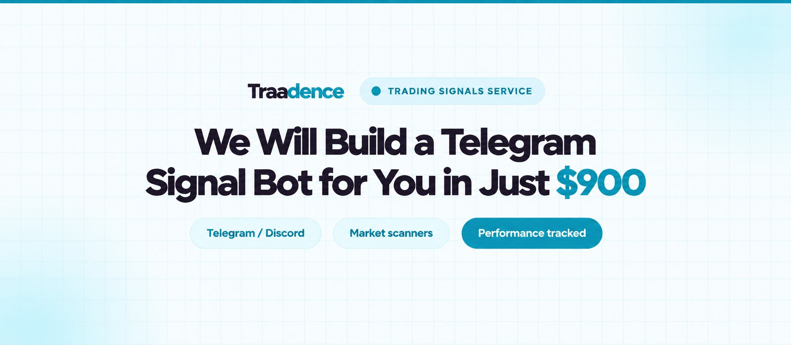
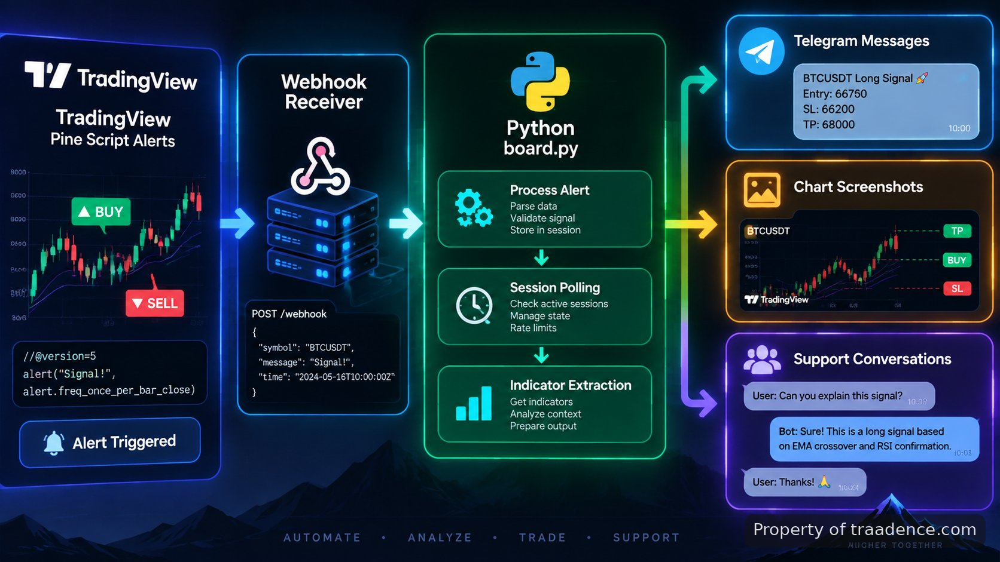

<p align="center">
  <a href="https://www.traadence.com" target="_blank" rel="nofollow">
    
  </a>
</p>

## Traadence's tradingview buy sell indicator

Traadence's tradingview buy sell indicator connects Pine Script alerts from TradingView charts with a Python Telegram bot backend. The system receives indicator events, checks market selections and timeframe filters, creates chart evidence, and delivers structured updates through Telegram conversations. The build is designed for traders who need a controlled signal delivery path rather than manually copying alert information between platforms.

> A signal workflow that turns chart events into structured Telegram conversations.

<a href="https://www.traadence.com" target="_blank" rel="nofollow">
  
</a>

<p align="center">
  <a href="https://t.me/Bitbash333" target="_blank" rel="nofollow">
    
  </a>&nbsp;
  <a href="https://wa.me/923249868488?text=Hi%2C%20I%27m%20interested%20in%20Traadence." target="_blank" rel="nofollow">
    
  </a>&nbsp;
  <a href="mailto:hello@traadence.com" target="_blank" rel="nofollow">
    
  </a>&nbsp;
  <a href="https://www.traadence.com" target="_blank" rel="nofollow">
    
  </a>
</p>



## Trading signal delivery architecture

The system separates chart logic from communication logic. TradingView handles the indicator event, while the Python service receives the payload and decides what information should reach each Telegram user. A webhook listener accepts incoming alerts, validates fields such as symbol and timeframe, then passes the event into the notification layer. The backend uses polling to maintain active user sessions and support conversations without mixing user states.

A typical alert flow starts when a Pine Script condition produces a buy or sell event. The webhook payload can include the instrument, timeframe, indicator value, and message metadata. The Python process stores the event, formats the response, and sends the update through the Telegram Bot API. TradingView webhook behaviour is documented in the official <a href="https://www.tradingview.com/support/solutions/43000529348-how-to-configure-webhook-alerts/" target="_blank" rel="nofollow">TradingView alerts documentation</a>, and Telegram message handling follows the <a href="https://core.telegram.org/bots/api" target="_blank" rel="nofollow">Telegram Bot API reference</a>.

## Core Features

| Feature | Description |
| --- | --- |
| Pine Script alert intake | Manual monitoring of charts is removed by receiving TradingView events through webhook requests and converting them into backend actions. |
| Telegram signal routing | Users receive filtered alerts inside Telegram based on selected market and timeframe preferences stored by the bot. |
| Indicator value extraction | Unstructured alert messages are converted into usable fields so the server can display indicator conditions and event details. |
| Dynamic chart screenshots | Traders do not need to reopen charts to review a signal because the backend generates visual context attached to messages. |
| Session polling system | Separate user states are maintained so commands, selections, and conversations are handled by the correct session. |
| Agent support controls | Support operators can communicate with active users and terminate conversations using the restricted stop command. |

## Telegram trading bot workflow

The Telegram layer is built around simple user actions. A new user starts with `/start`, chooses the Gold market option, and applies a timeframe filter before receiving matching alerts. The bot stores these selections and uses them when new indicator events arrive. This keeps the message stream tied to the preferences selected by each account.

The backend command handler is built with Python and follows Telegram's update model. Python Telegram Bot patterns, including handlers, commands, and callbacks, are covered in the official <a href="https://docs.python-telegram-bot.org/" target="_blank" rel="nofollow">Python Telegram Bot documentation</a>. The service keeps command processing separate from alert processing so a user changing preferences does not interrupt signal delivery.

<a href="https://tally.so/r/vG5J40?platform=GitHub&amp;format=Product+repo&amp;brand=Traadence&amp;niche=trading&amp;page=Tradingview+buy+sell+indicator+on+TradingView&amp;date=2026-09-11" target="_blank" rel="nofollow">
  
</a>

## Technical stack and deployment

The core runtime uses Python because the workflow requires webhook handling, asynchronous message processing, file generation, and session management in one service. The main execution file, `board.py`, coordinates the Telegram commands, signal parsing, screenshot creation, and terminal logging.

The deployment keeps the trading logic independent from the communication layer. Pine Script remains responsible for chart-side conditions, while the Python service manages delivery. The integration follows TradingView's alert model and Telegram's bot infrastructure rather than placing execution logic inside the chat interface.

```text
TradeAlertsBot/
├── board.py
├── config/
│   └── settings.py
├── handlers/
│   ├── commands.py
│   └── support.py
├── signals/
│   ├── parser.py
│   └── indicator.py
├── screenshots/
│   └── .gitkeep
└── logs/
    └── sessions.log
```

```python
def handle_alert(payload):
    symbol = payload.get('symbol')
    timeframe = payload.get('timeframe')
    value = payload.get('indicator_value')
    return {
        'symbol': symbol,
        'timeframe': timeframe,
        'value': value
    }
```

## Signal reporting and chart evidence

A text alert alone can leave users without enough context. The backend addresses this by generating chart screenshots alongside extracted indicator values. For example, an incoming Gold alert on a 15-minute timeframe can be transformed into a Telegram message containing the signal type, timeframe, indicator reading, and an attached chart capture.

The screenshot workflow records what was available when the alert arrived. This creates a traceable reference for reviewing messages later and gives support operators more information when answering user questions. The system does not alter the original TradingView chart logic; it records and presents the event generated by that logic.

## User support session management

Live support is handled through the same Telegram channel while keeping support permissions separate from normal user commands. Messages are routed through active sessions, allowing an agent to respond to a specific conversation. The restricted stop command closes the active support session and prevents further routing for that conversation.

Server terminal logs capture user feedback events, command activity, and support session changes. These records help trace whether a message was received, filtered, delivered, or closed. Session tracking follows the same principle used in other event-driven applications: each update carries enough context to identify its owner and action.

## Use Cases

- Traders following indicator alerts can receive filtered Gold market updates in Telegram without watching charts continuously.
- Signal providers can deliver chart-backed notifications with indicator values and screenshots attached to each event.
- Trading communities can manage user questions through tracked support sessions instead of scattered chat replies.

## How to Automate Signals Using Traadence's tradingview buy sell indicator

- **STEP 1 — Download & Set Up the Project** Download <a href="https://github.com/Zeeshanahmad4/TradeAlertsBot-Integrate-TradingView-with-Telegram.git" target="_blank" rel="nofollow">Traadence's tradingview buy sell indicator</a> and configure the Python environment to run the Telegram backend.
- **STEP 2 — Start The Bot** Launch `board.py` and open the Telegram interface to access `/start` and user selection menus.
- **STEP 3 — Select Filters** Choose the Gold market option and timeframe filters so the bot routes matching indicator events.
- **STEP 4 — Review Output** Receive Telegram alerts containing extracted values, generated screenshots, and support responses.

## Repository references

The implementation relies on documented platform behaviour. Developers working with this repository can review <a href="https://www.tradingview.com/pine-script-docs/" target="_blank" rel="nofollow">Pine Script language references</a>, <a href="https://core.telegram.org/bots" target="_blank" rel="nofollow">Telegram bot development guidance</a>, and <a href="https://docs.python.org/3/library/asyncio.html" target="_blank" rel="nofollow">Python asyncio documentation</a> when extending the service. Trading workflows should also consider exchange and market structure references such as the <a href="https://www.cmegroup.com/education.html" target="_blank" rel="nofollow">CME Group education resources</a> and <a href="https://www.investor.gov/introduction-investing/investing-basics" target="_blank" rel="nofollow">SEC investor trading resources</a>.

## FAQ

### How does the Telegram bot receive TradingView signals?

The bot receives TradingView webhook alerts generated by Pine Script conditions. The backend validates the incoming payload, extracts fields such as symbol and timeframe, then sends formatted updates to matching Telegram sessions.

### Can the system show chart screenshots with alerts?

Yes. The backend generates chart screenshots and attaches them to Telegram messages with extracted indicator information. This gives users a visual record of the alert event that triggered the notification.

### How are user sessions managed by the backend?

User sessions are tracked through the Python backend so commands, market selections, timeframe filters, and support conversations remain associated with the correct user state.

### Can support agents end active conversations?

Yes. Support agents can communicate through active Telegram sessions and use the restricted stop command to terminate a live support conversation.

<table>
  <tr>
    <td align="center" width="33%">
      
      <p>This scraper helped me gather thousands of posts effortlessly. The setup was fast, and exports are super clean and well-structured.</p>
      <p><b>Nathan Pennington</b><br>Marketer<br>★★★★★</p>
    </td>
    <td align="center" width="33%">
      
      <p>What impressed me most was how accurate the extracted data is. Likes, comments, timestamps — everything aligns perfectly.</p>
      <p><b>Greg Jeffries</b><br>SEO Affiliate Expert<br>★★★★★</p>
    </td>
    <td align="center" width="33%">
      
      <p>It's by far the best tool I've used. Ideal for trend tracking, competitor monitoring, and influencer insights.</p>
      <p><b>Karan</b><br>Digital Strategist<br>★★★★★</p>
    </td>
  </tr>
</table>